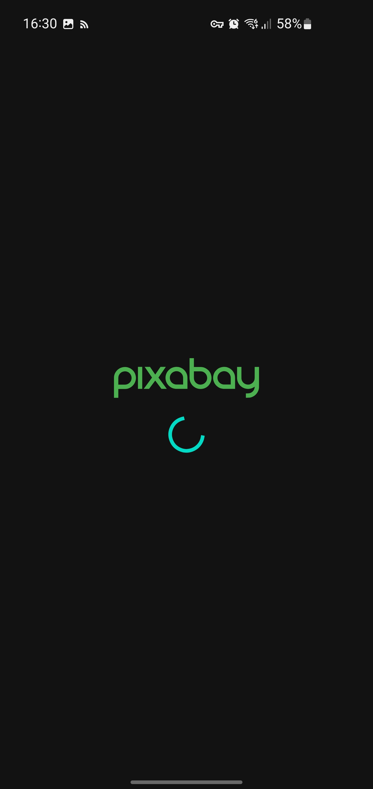
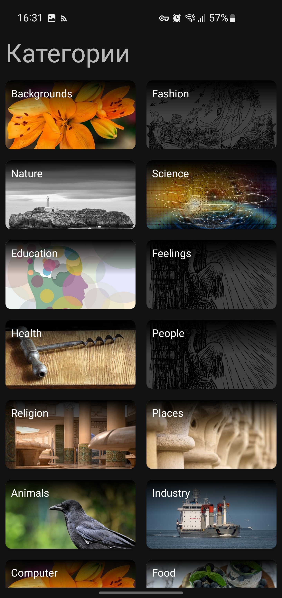
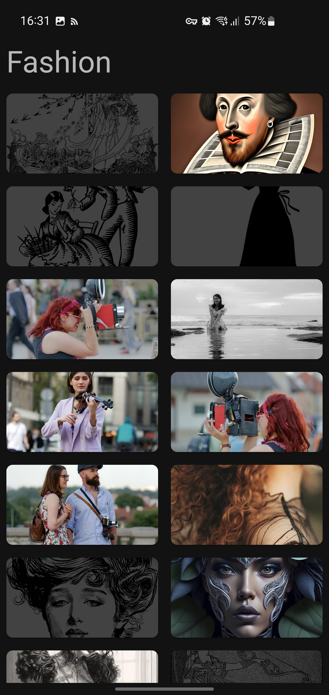

# Pixabay Wallpapers

Приложение для получения изображений с сервиса Pixabay и возможности установить их в качестве обоев на телефон. Для работы с API я использовал Retrofit и Coroutines, для получения изображений Glide. Архитектура MVVM, инъекция зависимостей Hilt.

**Для работы приложения необходим включенный VPN!!!**

## Стек
 - Kotlin
 - MVVM
 - DataBinding
 - Clean Architecture
 - Hilt
 - LiveData
 - AndroidX Navigation
 - OkHttp3
 - Retrofit2
 - Glide
## Скриншоты

